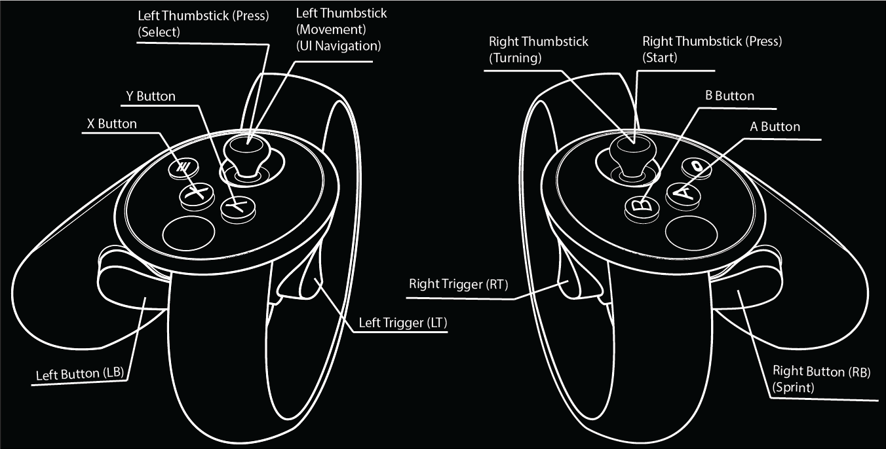
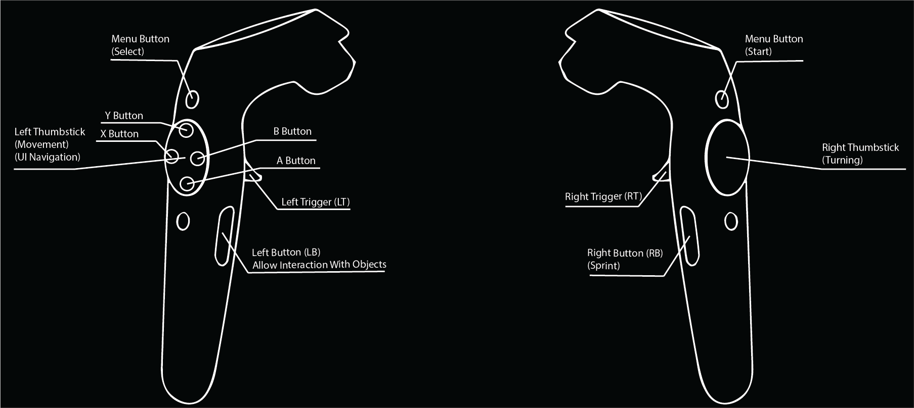
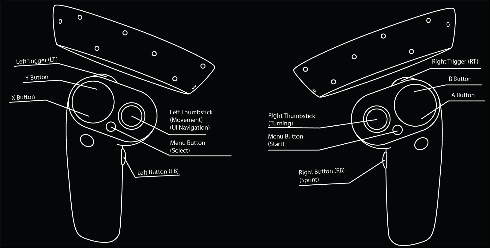

# DawnVR 
VR mod for Life Is Strange: Before The Storm

## Installation
1. Follow the [Automated Installation guide](https://melonwiki.xyz/#/?id=automated-installation) on the MelonLoader wiki page, installing to the Life is Strange: Before the Storm exe.
   - If you do not know where your install's exe is, open Steam, find the game, right click it, and select Manage -> Browse Local Files, this will lead you to your game's installation.
   - Make sure to choose MelonLoader version 0.5.1 instead of latest, 0.5.3 has compatibility issues with some part of the game.
2. Download the latest release from [here](https://github.com/TrevTV/DawnVR/releases/latest) and open it.
3. In your game's installation directory, drag all the files from the zip into that directory, Windows should merge the folders.
4. In your Steam launch parameters (Right click -> Properties -> Launch Options) add `-vrmode OpenVR` (case-sensitive)
5. In your game's Steam settings, find `Use Desktop Game Theatre while SteamVR is active` and make sure it is unchecked.
6. Start the game, on first boot after installation the VREnabler plugin will extract the needed files, which may take a minute.

## Controls
Each VR controller's buttons are mapped to corresponding buttons that would be on a Xbox One controller, as this was the easiest method to implement it.

## Configurable Options

### Movement/Turning
- `MovementThumbstick` allows you to change the dominant hand for movement and UI interactions `(default: Left)`
- `UseSmoothTurning` allows you to toggle smooth turning `(default: true)`
- `SmoothTurnSpeed` allows you to change the speed of smooth turning, if enabled `(default: 120)`
- `UseSnapTurning` allows you to toggle snap turning `(default: false)`
- `SnapTurnAngle` allows you to change the angle that snap turning rotates by `(default: 45)`

### Spectator Camera
- `SpectatorEnabled` enables a separate camera for the monitor which has a higher FOV by default `(default: false)`
- `SpectatorFOV` allows you to change the FOV of the spectator camera `(default: 90)`

### Misc
- `CheckForUpdatesOnStart` checks for any mod updates every time the game boots `(default: true)`
- `Use2DCutsceneViewer` puts you in a bordered box for cutscenes, disabling this renders cutscenes in VR and allowing you to move your head around `(default: true)`
- `AllowSkippingAnyCutscene` allows you to skip any cutscene regardless of you being in collector mode `(default: false)`
- `DetachUIOnJournalOpen` disconnects the UI from the camera whenever the journal is opened, making it easier to read `(default: true)`

### Debugging
- `EnableInternalLogging` allows you to redirect internal logging calls from the game and have them shown in the MelonLoader console `(default: false)`
- `EnablePlayerCollisionVisualization` enables capsules that appear the the feet of Chloe, simply to visualize her NavMeshAgent verses the VRRig `(default: false)`
- `RunNoVRHarmonyPatchesWhenDisabled` runs some Harmony patches specifically for non-VR testing, specifically skipping any cutscene and splash screen skipping `(default: false)`

## FAQ

### Do the in-game options effect anything?
The resolution and FPS cap are determined by SteamVR, completely ignoring the game's settings. The other graphical options do effect visuals and performance.

### Can this be used on the Linux version?
Possibly, with the recent remaster supports, a lot of the code was modified both for IL2CPP support alongside replacing obfuscated names with their originals. If the code was modified to keep a lot of the remaster changes, but moved to Mono, it is possible for it to work.

### I am receiving a Initalization Error in the console on startup!
Make sure you have the `-vrmode OpenVR` paramater setup and that SteamVR is open before launching the game. If neither of those are the issue, go into `Life is Strange - Before the Storm_Data` and delete the file `globalgamemanagers.bak` and restart the game.

### How can I temporarily disable the mod?
In the Steam launch parameters, simply replace OpenVR with None, the mod will recognize that change and will let the game load normally.

### Why is the mod using Powershell to get the latest version?
By default, Mono doesn't trust any websites, including GitHub. The script is a janky way of still retriving the data.

## Licensing
- [SteamVR Unity Plugin](https://github.com/ValveSoftware/steamvr_unity_plugin) licensed under the BSD 3-Clause license. See [LICENSE](https://github.com/ValveSoftware/steamvr_unity_plugin/blob/master/LICENSE) for the full license.
- [AssetsTools.NET](https://github.com/nesrak1/AssetsTools.NET/) (included in compiled form) licensed under the MIT license. See [LICENSE](https://github.com/nesrak1/AssetsTools.NET/blob/master/LICENSE) for the full license.
- [UnityCsReference](https://github.com/Unity-Technologies/UnityCsReference/) (only the UnityEngine.Events namespace, in decompiled form) licensed under the Unity Reference-Only License. See [Unity3D.com](https://unity3d.com/legal/licenses/Unity_Reference_Only_License) for the full license.

## Credits
- [MrPurple](https://github.com/MrPurple6411) and [DrBibop](https://github.com/DrBibop) for the VREnabler code (though I have modified it to just extract a pre-modified globalgamemanagers)
- [DrBibop](https://github.com/DrBibop) for the RoR2 mod and for helping me with some VR rig handling
- [Sinai](https://github.com/sinai-dev/) for creating UnityExplorer (and quickly fixing a bug I had) which definitely helped speed up the development process
- `elliotttate#9942` for some assistance in the Flatscreen to VR Modding Discord
- `alecpizz#0311` for helping me with some rig stuff, giving me some code, and testing parts of the mod
- `Parzival#7273` for the idea of a monitor-like border during cutscenes
- `progrocknic#9377` and `agentm83#7067` for testing the Knuckles controller bindings
- Probably a few other people I've forgotten
